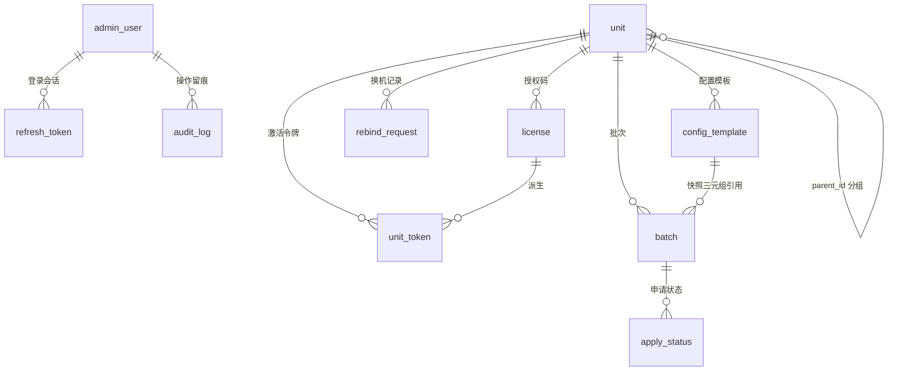

# 数据库说明

> **双仓协同**：契约 DDL 权威在 SCES-Server `contracts/schema-web.sql`（当前主力开发线为本仓，契约问题随本仓批次一并修改后 `pnpm sync:contracts` 同步）。本仓 `supabase/migrations/0001_init.sql` 为其逐字节镜像，由脚本把关一致性（`check:contracts`）。测试（PGlite）与生产（Supabase）跑同一份 DDL。
>
> **unit_type 评审结论**：`unit.unit_type`（college/department/other）三仓均无行为分支，纯展示字段；现阶段保留（种子与契约均有值），确认无展示需求后可随契约批次移除。
>
> 通用约定：主键 `TEXT`（uuid 或语义 id）；时间戳 `BIGINT` epoch 毫秒；JSON 一律存 `TEXT`（应用层解析，避免方言依赖）；枚举用 `CHECK` 约束。
## 目录

- [表关系总览](#表关系总览)
- [表清单](#表清单)
- [级联规则](#级联规则)
- [索引清单](#索引清单)
- [隐私与红线](#隐私与红线)
- [过期刷新令牌清理](#过期刷新令牌清理)
- [迁移流程](#迁移流程)

---

## 表关系总览



层级规则（DDL CHECK 强制）：`level=1 AND parent_id IS NULL`（一级为分组）或 `level=2 AND parent_id IS NOT NULL`（二级为独立单位）。二级是唯一批次主体。

## 表清单

### `admin_user` — 后台管理员

| 列 | 类型 | 说明 |
|----|------|------|
| id | TEXT PK | uuid |
| username | TEXT UNIQUE | 登录名 |
| password_hash | TEXT | scrypt，格式 `scrypt$N$r$p$salt$hash` |
| must_change_password | SMALLINT 0/1 | 1 = 首登强制改密（`ADMIN_INITIAL_PASSWORD` 建号时置 1） |
| created_at / updated_at | BIGINT | epoch ms |

### `refresh_token` — 后台刷新令牌

| 列 | 类型 | 说明 |
|----|------|------|
| id | TEXT PK | uuid |
| admin_user_id | TEXT FK→admin_user **CASCADE** | 归属 |
| token_hash | TEXT UNIQUE | **只存 SHA-256**，明文仅签发时返回一次 |
| expires_at | BIGINT | 30 天 |

登出/改密即删除该管理员全部行（决策 #40：登出即删，无需每请求查吊销名单）。

### `unit` — 单位（一级分组 / 二级独立单位）

| 列 | 类型 | 说明 |
|----|------|------|
| id | TEXT PK | camelCase 语义 id（如 `nxu`、`nxuLx`） |
| name | TEXT | 显示名 |
| unit_type | TEXT CHECK | `college` / `department` / `other`（默认落 `other`）。**评审结论**：三仓均无行为分支（无 `unitType` 比较/条件），纯展示字段；暂保留，若确认无展示需求可随契约批次移除 |
| level | SMALLINT CHECK | 1 / 2 |
| public_key_jwk | TEXT NULL | 单位公钥 JWK（JSON 存 TEXT）；**私钥永不入库** |
| status | TEXT CHECK | `active` / `disabled` |
| created_at / updated_at | BIGINT | |

### `license` — 授权码

| 列 | 类型 | 说明 |
|----|------|------|
| code | TEXT PK | `^[A-Z0-9]{4}(-[A-Z0-9]{4}){3}$`（去易混淆字符集） |
| unit_id | TEXT FK→unit **CASCADE** | 归属 |
| expires_at | BIGINT | 续期即延后此值 |
| status | TEXT CHECK | `active` / `expired`（惰性判定）/ `revoked` |
| renewed_at / renew_count | BIGINT / SMALLINT | 续期审计与次数 |
| created_at / updated_at | BIGINT | |

约束：`uq_license_active_unit`——**一个单位至多一条未作废授权码**（部分唯一索引 `WHERE status <> 'revoked'`，已作废历史行保留审计轨迹不占名额）。换码路径（自助换机 `POST /units/rebind`、后台放行）统一「先作废旧码、再签发新码」，同一事务完成。

### `unit_token` — 单位激活令牌（管理端 Bearer）

| 列 | 类型 | 说明 |
|----|------|------|
| id | TEXT PK | uuid |
| unit_id | TEXT FK→unit **CASCADE** | |
| install_id | TEXT | 绑定管理端安装实例；换机即失效旧令牌 |
| license_code | TEXT FK→license **CASCADE** | 派生来源；作废该码级联失效其全部令牌 |
| token_hash | TEXT **UNIQUE** | **只存 SHA-256**；明文仅 `authorize` 响应一次 |
| expires_at | BIGINT | = 授权码 `expires_at` |
| status | TEXT CHECK | `active` / `revoked` |

校验联表：`unit_token ⋈ license ⋈ unit`——令牌 active 且未过期、授权 active、单位 active 三级全过才放行（`http/guards.ts`）。

### `rebind_request` — 换机记录

| 列 | 类型 | 说明 |
|----|------|------|
| id | TEXT PK | uuid |
| unit_id | TEXT FK→unit **CASCADE** | |
| install_id | TEXT | 新安装实例 |
| reason / old_code / new_code | TEXT | 摘要（pending 记录 old/new 均空，放行时回填） |
| status | TEXT CHECK | `self-served` / `pending` / `approved` / `rejected` |
| month_key | TEXT | `YYYY-MM`，频次计数窗口 |
| month_count | SMALLINT | 该月第 N 次（月限 3 次） |
| created_at / resolved_at | BIGINT | |

### `config_template` — 配置模板（版本化）

| 列 | 类型 | 说明 |
|----|------|------|
| id + version + revision | 复合 PK | 版本三元组；历史全保留（决策 #37） |
| unit_id | TEXT FK→unit **CASCADE** | 归属单位 |
| name | TEXT | 显示名 |
| status | TEXT CHECK | `draft` / `published` / `archived` |
| schema_version | SMALLINT | unit-config schema 版本（当前 1） |
| unit_json / class_json / student_json / dyf_json / calc_json / rank_json | TEXT | UnitConfig 六段 JSON（`_json` 后缀避免标识符歧义） |
| created_at / updated_at | BIGINT | |

约束：`uq_config_template_published`——**每个模板 id 至多一个 published**（部分唯一索引 `WHERE status='published'`）。

### `batch` — 批次（仅公开字段）

| 列 | 类型 | 说明 |
|----|------|------|
| id | TEXT PK | 批次 id |
| unit_id | TEXT FK→unit **CASCADE** | 二级单位 |
| year / semester | SMALLINT CHECK | 学年学期 |
| is_test | SMALLINT CHECK | 0 正式 / 1 测试 |
| status | TEXT CHECK | `draft` → `active` → `closed` |
| apply_start_at / apply_end_at | BIGINT NULL | 申请窗口 |
| calc_mode | TEXT CHECK | `weighted` / `formula` |
| calc_config | TEXT | 计算配置 JSON |
| public_key_jwk | TEXT | 批次快照公钥 |
| config_template_id + version + revision | 复合 FK→config_template **RESTRICT** | **快照三元组引用**：发布后归档不影响批次 |
| created_at / updated_at | BIGINT | |

约束：`uq_batch_official_term`——同单位同学年学期唯一**正式**批次（部分唯一索引 `WHERE is_test = 0`）。

### `apply_status` — 申请状态（隐私最小化）

| 列 | 类型 | 说明 |
|----|------|------|
| apply_id_hash | TEXT **PK 之一** | **applyId 的 SHA-256**；不存学号/姓名/分数 |
| unit_id + batch_id | FK **CASCADE** | 归属 |
| review_round | SMALLINT PK 之一 | 轮次（≥1），跨轮新行 |
| status | TEXT CHECK | `draft` → `submitted` → `imported` → `reviewing` → `confirmed` |
| latest_revision | SMALLINT NULL | 学生端 register 上报的最新版本（决策 #39） |
| imported_revision / imported_at | SMALLINT / BIGINT | 管理端导入版本（与 latest 比对提示索要新版） |
| created_at / updated_at | BIGINT | |

### `audit_log` — 审计日志

| 列 | 类型 | 说明 |
|----|------|------|
| id | BIGSERIAL PK | 游标分页用 |
| admin_user_id | TEXT FK→admin_user **SET NULL** | 操作者（管理员删除后保留日志） |
| action | TEXT | kebab-case，如 `unit-create` / `license-issue` / `admin-change-password` |
| target | TEXT | 操作对象标识 |
| detail / ip | TEXT NULL | 详情与来源 IP |
| created_at | BIGINT | |

`schema_migrations`：迁移版本表（`db:migrate` 幂等应用）。

## 级联规则

| 操作 | 级联效果 |
|------|----------|
| 删除二级单位 | license / unit_token / rebind_request / config_template / batch / apply_status 全部 CASCADE 清除（batch 先显式删，见下） |
| 删除一级单位 | 有下级 → **RESTRICT 409**（先删下级）；无下级 → 可删 |
| 删除授权码 | 其派生的全部 unit_token CASCADE 失效 |
| 作废授权码（软删除） | 该码全部 active unit_token 置 revoked |
| 删除批次 | 其 apply_status CASCADE 清除 |
| 删除管理员 | refresh_token CASCADE；audit_log **SET NULL**（留痕不删） |
| 删除被批次引用的模板 | **RESTRICT**——批次快照三元组不可悬空；删单位时先删 batch 再级联模板（`repos/admin-units.ts deleteUnit`） |

## 索引清单

| 表 | 索引 | 用途 |
|----|------|------|
| refresh_token | (admin_user_id), (expires_at) | 删全部会话 / 过期清理 |
| unit | (parent_id), (status, level) | 树查询 / 列表过滤 |
| license | (unit_id), (status), UNIQUE(unit_id) WHERE status≠revoked | 单位详情 / 状态筛选 / 单位至多一条未作废授权码 |
| unit_token | (unit_id, install_id), (license_code) | 换机失效 / 级联作废 |
| rebind_request | (unit_id, month_key), (status) | 月限计数 / 待放行队列 |
| config_template | (unit_id), UNIQUE(id) WHERE published | 单位模板 / published 唯一性 |
| batch | (unit_id, status), (unit_id, status, is_test, created_at), UNIQUE(unit_id, year, semester) WHERE is_test=0 | 列表 / 活跃批次下发 / 正式批次唯一 |
| apply_status | (batch_id, status), (unit_id) | 批次下发 / 单位统计 |
| audit_log | (created_at), (action), (target) | 游标分页 / 类型筛选 / 对象追溯 |

## 隐私与红线

| 数据 | 处理 |
|------|------|
| applyId | 只存 `SHA-256`（`apply_id_hash`）；明文不出现在任何列 |
| unitToken / refreshToken | 只存 SHA-256（`token_hash`），UNIQUE 索引即查询路径 |
| 私钥 | 无对应列——`.dyf` 混合加密的私钥只在书院管理端本地 |
| 分数明细 / 证明材料 | 无对应列——服务端只有状态机 |
| 学生身份 | 不存学号/姓名；`apply_status` 无法反查到个人 |

红线由 `tests/schema.test.ts` 断言把关（列清单白名单，出现敏感列即测试失败）。

## 过期刷新令牌清理

登出/改密会删除该管理员的刷新令牌；但长期不登出、token 自然过期的失效会话会留死行。每次后台登录（`POST /api/v1/admin/auth/login`）成功后顺手删除过期刷新令牌（走 `idx_refresh_token_expires_at`，见 `server/utils/routes/admin-auth.ts`）。

## 迁移流程

```sh
# 权威 DDL 变更（在 SCES-Server 仓库改 schema-web.sql 并 verify 通过后）
pnpm sync:contracts        # 镜像更新 supabase/migrations/0001_init.sql
pnpm db:migrate            # 应用到 Supabase（schema_migrations 记版本，已应用自动跳过）
```

`0001_init.sql` 为全量幂等建库 DDL（`CREATE TABLE IF NOT EXISTS` / `CREATE INDEX IF NOT EXISTS`）。
破坏性变更新增 `0002_*.sql` 等，`scripts/apply-migrations.mjs` 按文件名序应用，
`schema_migrations` 记录已应用版本，重复执行自动跳过（当前已含 `0002_enable_rls.sql`：
启用行级安全并回收 Data API 角色的表权限，见文件头注释）。

`0003_production_hardening.sql` 增加 `batch.key_id`、`unit.config_template_id` 和第 12 张表 `rate_limit_bucket`，并增加活跃安装令牌唯一索引。已有批次的 key_id 保留 NULL，不伪造历史加密密钥标识；补齐前不得向学生端发布该批次。迁移会将同一安装实例重复的活跃令牌仅保留最新一条，其余标记 revoked，需要在 staging 核对客户端影响。

迁移 runner 使用事务级锁，版本记录使用 BIGINT 毫秒，支持修复历史 INTEGER 版本列。测试覆盖全新库、旧版结构、失败回滚和 PGlite 本地恢复；真实 Supabase 升级和 pg_dump 恢复另行验收。
